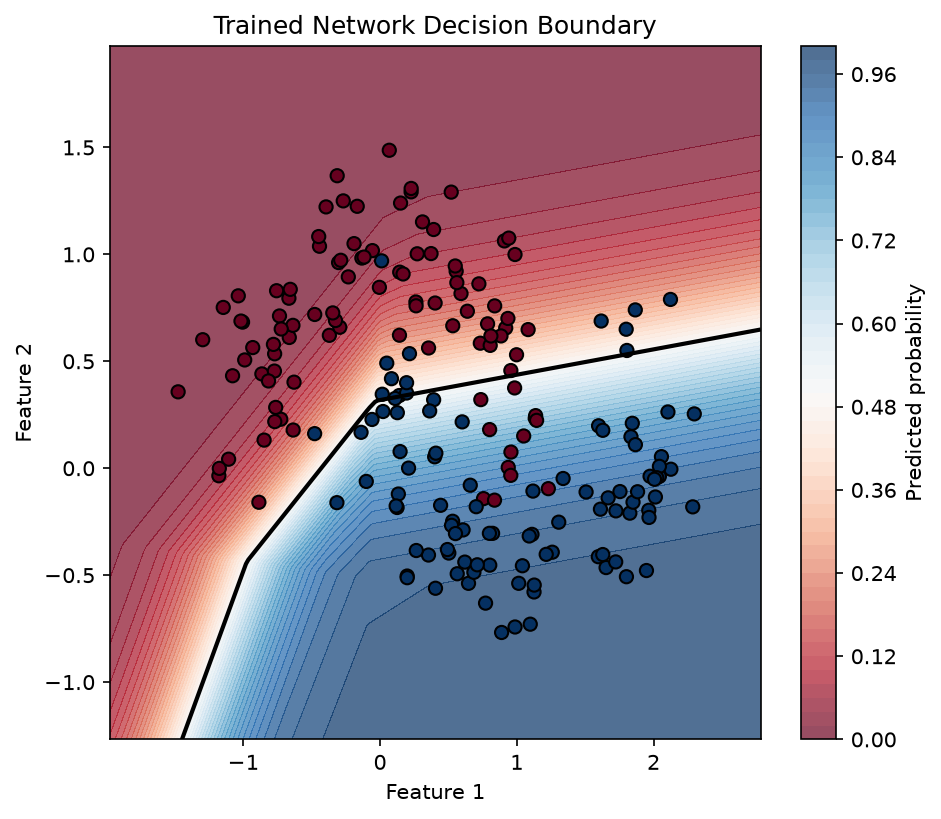

# neural-network-lab

A neural network engine built entirely from scratch with NumPy — no PyTorch, no TensorFlow, no autograd. Every forward pass, every gradient, and every parameter update is implemented and verified by hand.

## What I Built

This project implements a fully connected neural network training engine from first principles:

- Forward and backward propagation, implemented manually using the chain rule
- Numerical gradient checking to verify the correctness of every gradient
- L1 and L2 regularization
- Three optimizers: SGD, Momentum, and Adam
- A decision boundary visualizer for 2D toy datasets
- A full pipeline scaled up to real data: a 784-128-64-10 network trained on MNIST, reaching 97.75% test accuracy
- A pytest suite (16 tests) covering forward/backward correctness, gradient checks, and a regression test for a real bug found during development
- Continuous integration via GitHub Actions, running the full test suite on every push

## Why

Most machine learning projects at this level call model.fit() on a framework and stop there. This project instead asks: what does it take to make a neural network actually learn, if you have to implement every piece of the training loop yourself? The goal was to build something where I could explain, line by line, why the network works — not just that it works.

## Architecture

Toy network (used for the 2D experiments and visualizations):

Input (2) -> W1, b1 -> ReLU -> W2, b2 -> Sigmoid -> Output (1)

MNIST network:

Input (784) -> W1, b1 -> ReLU -> W2, b2 -> ReLU -> W3, b3 -> Softmax -> Output (10)

Weights are initialized with He initialization (std = sqrt(2 / fan_in)), appropriate for ReLU activations.

## Backprop Implementation

The backward pass is derived by hand using the chain rule, starting from the loss function and working backward through each layer. For the toy network:

The gradient of the loss with respect to `Z2` simplifies to `(y_hat - y_true) / n` for the sigmoid + binary cross-entropy combination (and to the same structural form for softmax + categorical cross-entropy in the MNIST network). All layer-by-layer gradients are computed manually in `engine/network.py` and `engine/mnist_network.py`.

## Verification

Every gradient is checked against a numerical estimate computed by perturbing each parameter by a small epsilon and measuring the resulting change in loss:

Gradient checks pass with relative errors in the 1e-7 to 1e-10 range across all parameters (see `engine/gradient_check.py` and `tests/test_network.py` / `tests/test_mnist_network.py`).

### A real bug this caught

During development, the loss function silently produced incorrect values due to a shape mismatch: `y_true` had shape `(n,)` while `y_pred` had shape `(n, 1)`, and NumPy broadcasting silently expanded the multiplication into an `(n, n)` array instead of raising an error. The result was a loss value that looked plausible but was mathematically wrong, and training that never converged even though the gradients "looked" fine at a glance. This was caught by comparing training loss curves against expectations, then confirmed by a targeted numerical gradient check. The fix — explicitly reshaping `y_true` to match `y_pred` before computing the loss — is covered by a regression test in `tests/test_network.py::test_binary_cross_entropy_shape_mismatch_regression`, so it cannot silently reappear.

## Interactive Demo

The decision boundary visualizer (`engine/visualize.py`) plots the trained network's learned classification boundary directly, using a TensorFlow Playground style orange/blue color scheme:

The boundary is piecewise linear, which is expected: a single ReLU hidden layer can only produce a decision boundary made of straight line segments, which is also why accuracy plateaus around 86% on the `make_moons` dataset rather than approaching 100% — the network cannot bend a boundary to perfectly trace a curved, non-linearly-separable shape with this architecture.

## Experiments

### Regularization comparison

| Configuration | Final Accuracy | Final Loss | Weight Sparsity |
|---|---|---|---|
| No Regularization | 0.8650 | 0.2825 | 0.0000 |
| L1 Regularization | 0.8650 | 0.2992 | 0.2500 |
| L2 Regularization | 0.8450 | 0.3500 | 0.0000 |

L1 regularization produced 25% sparse weights (weights driven to near-zero), while L2 and no-regularization produced none — consistent with the theoretical expectation that L1's constant-magnitude gradient (`sign(W)`) pushes small weights all the way to zero, while L2's gradient (proportional to `W`) shrinks weights without eliminating them.

### Optimizer comparison

| Optimizer | Final Accuracy | Final Loss | Epochs to 85% Accuracy |
|---|---|---|---|
| SGD | 0.8400 | 0.3002 | 215 |
| Momentum | 0.8400 | 0.3001 | 240 |
| Adam | 0.8350 | 0.3113 | 59 |

Adam reached 85% accuracy roughly 3-4x faster than SGD or Momentum, consistent with its adaptive per-parameter learning rate. Momentum did not outperform plain SGD in this specific setup — on this small network and simple dataset, the loss surface likely does not have the kind of oscillation or narrow ravines that momentum is designed to accelerate through. This is reported as-is rather than adjusted to fit the expected result.

## MNIST

The same engine, extended to a 784-128-64-10 fully connected network with softmax output and categorical cross-entropy loss, trained with mini-batch gradient descent (batch size 64, learning rate 0.1, 20 epochs):

    epoch 0,  avg_loss=0.3234, train_acc=0.9436, test_acc=0.9358
    epoch 1,  avg_loss=0.1462, train_acc=0.9620, test_acc=0.9545
    epoch 2,  avg_loss=0.1030, train_acc=0.9741, test_acc=0.9642
    epoch 3,  avg_loss=0.0799, train_acc=0.9822, test_acc=0.9680
    epoch 4,  avg_loss=0.0645, train_acc=0.9775, test_acc=0.9646
    epoch 5,  avg_loss=0.0532, train_acc=0.9824, test_acc=0.9667
    epoch 6,  avg_loss=0.0447, train_acc=0.9795, test_acc=0.9610
    epoch 7,  avg_loss=0.0377, train_acc=0.9878, test_acc=0.9684
    epoch 8,  avg_loss=0.0327, train_acc=0.9910, test_acc=0.9714
    epoch 9,  avg_loss=0.0281, train_acc=0.9795, test_acc=0.9603
    epoch 10, avg_loss=0.0229, train_acc=0.9953, test_acc=0.9748
    epoch 11, avg_loss=0.0194, train_acc=0.9971, test_acc=0.9758
    epoch 12, avg_loss=0.0160, train_acc=0.9950, test_acc=0.9751
    epoch 13, avg_loss=0.0135, train_acc=0.9987, test_acc=0.9783
    epoch 14, avg_loss=0.0108, train_acc=0.9990, test_acc=0.9775
    epoch 15, avg_loss=0.0091, train_acc=0.9990, test_acc=0.9766
    epoch 16, avg_loss=0.0069, train_acc=0.9990, test_acc=0.9764
    epoch 17, avg_loss=0.0065, train_acc=0.9997, test_acc=0.9775
    epoch 18, avg_loss=0.0051, train_acc=0.9998, test_acc=0.9772
    epoch 19, avg_loss=0.0041, train_acc=0.9996, test_acc=0.9775

    Final test accuracy: 0.9775

## Results

- **97.75% test accuracy** on MNIST using a from-scratch NumPy implementation, no external ML frameworks
- Training accuracy reached 99.96%, roughly 2.2 points above test accuracy — a sign of mild overfitting, discussed further below
- All gradients verified numerically with relative error below 1e-5 (typically 1e-7 to 1e-10)
- 16/16 pytest tests passing, enforced on every push via GitHub Actions

## Reproducibility

All experiments use fixed random seeds (numpy.random.default_rng(seed)). To reproduce:

    python3 -m venv venv
    source venv/bin/activate
    pip install numpy matplotlib scikit-learn pytest pandas

    python3 -m pytest tests/ -v              # run the full test suite
    python3 check_gradients.py               # gradient check on toy network
    python3 train_toy.py                     # train toy network
    python3 visualize_boundary.py            # generate decision boundary plot
    python3 compare_regularization.py        # L1 vs L2 vs no regularization
    python3 compare_optimizers.py            # SGD vs Momentum vs Adam
    python3 train_mnist.py                   # full MNIST training run

## Limitations

- The toy network's single hidden layer restricts it to piecewise linear decision boundaries, capping accuracy on non-linearly-separable 2D datasets like make_moons
- The MNIST network shows mild overfitting (99.96% train vs 97.75% test accuracy); the regularization tools built for the toy network (L1/L2) were not yet applied to the MNIST training run
- Momentum did not outperform SGD in the optimizer comparison; this is reported honestly rather than tuned to match textbook expectations, and is likely a property of this specific small-scale setup rather than a general claim about momentum
- No convolutional layers are used for MNIST; this was an intentional scope decision, since the goal of this project is depth of understanding of a fully connected network's training pipeline rather than breadth of architectures

## How to Run

    git clone https://github.com/shanshanouyang/neural-network-lab.git
    cd neural-network-lab
    python3 -m venv venv
    source venv/bin/activate
    pip install numpy matplotlib scikit-learn pytest pandas
    python3 -m pytest tests/ -v
